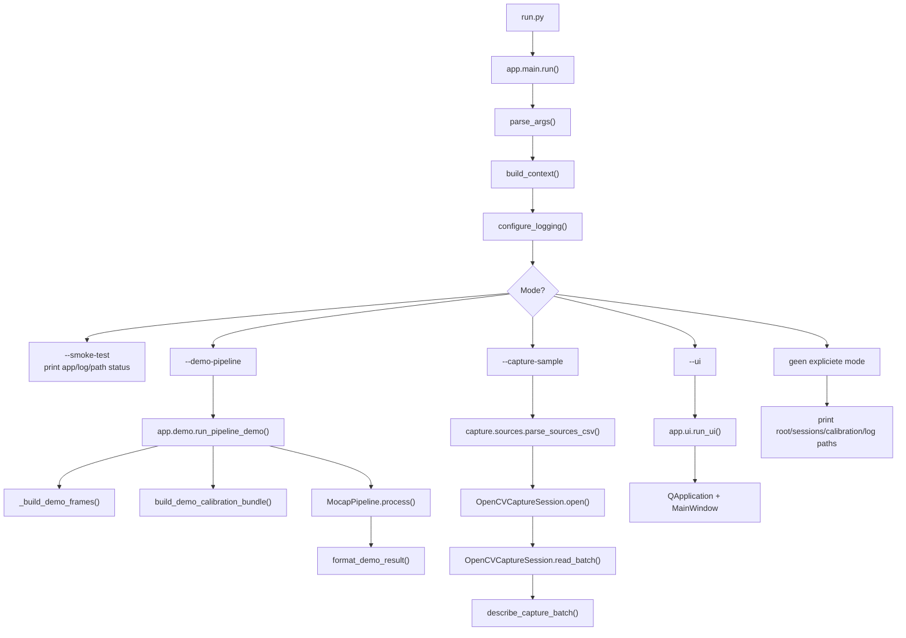
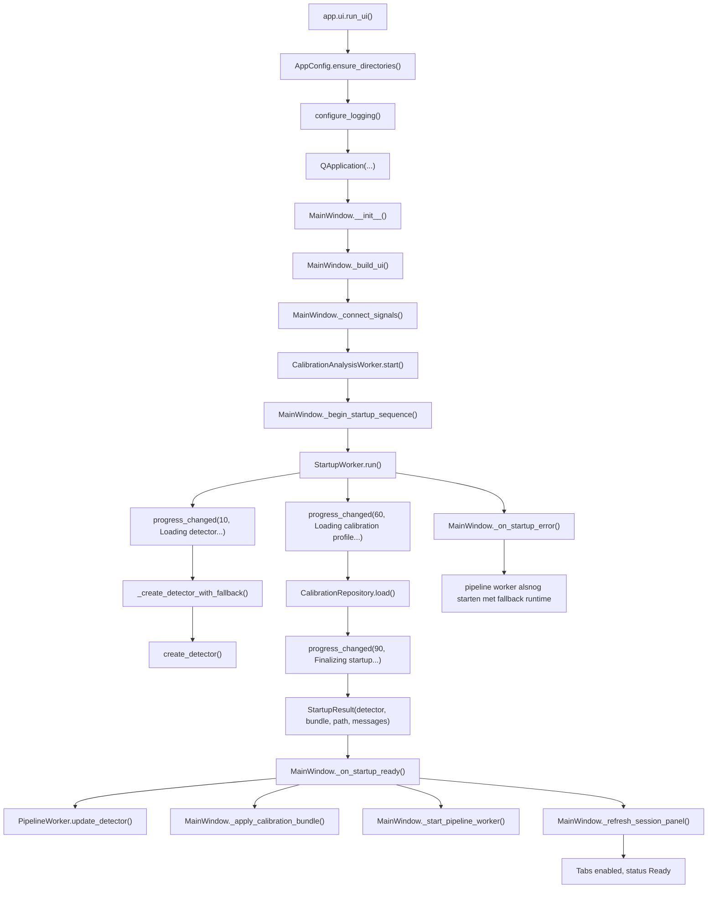
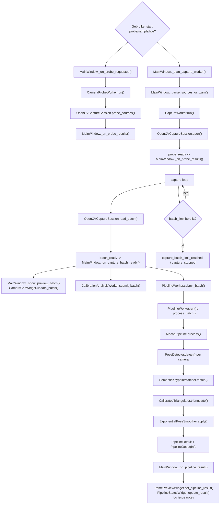
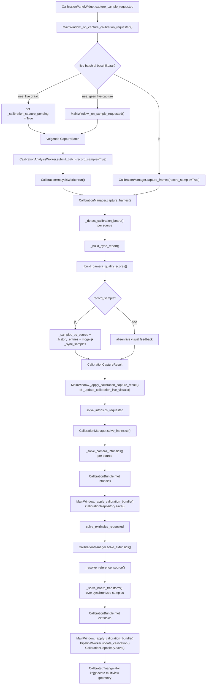
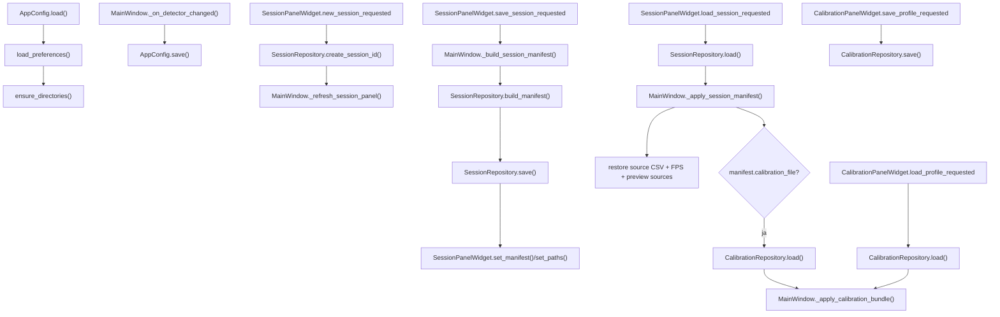

# Programma Structuur Engineering Flowchart

Dit document beschrijft de actuele softwareflow van de code in `Programma Structuur`.
De diagrammen en functie-index hieronder zijn gebaseerd op de daadwerkelijk aanwezige Python-modules, niet alleen op de mapnamen.
Voor een statische high-resolution export zie [FLOWCHART.png](FLOWCHART.png). De PNG kan opnieuw worden gegenereerd met [generate_flowchart_png.ps1](generate_flowchart_png.ps1).
Voor een eenvoudigere, schoolgerichte uitleg zie [UITLEG_SCHOOLVERSIE.md](UITLEG_SCHOOLVERSIE.md).

## Scope

- Gevalideerde entrypoints: `run.py`, `app/main.py`, `app/ui.py`
- Gevalideerde runtime-orchestratie: `ui/main_window.py`, `workers/*.py`, `pipeline/manager.py`
- Gevalideerde IO en opslag: `capture/backend.py`, `calibration/*`, `session/repository.py`, `core/config.py`
- Gevalideerde gedeelde contracten: `models/types.py`
- Placeholder-scaffolding zonder actuele implementatie: `batch/`, `biomechanics/`, `exporters/`, `fitting/`, `plugins/`, delen van `ui/`

## Kernobjecten In De Runtime

- `CameraSourceConfig`: beschrijft een webcam/video/file-bron.
- `FramePacket`: 1 frame met `source_id`, `frame_index`, `timestamp_sec`, `frame_data`.
- `CaptureBatch`: bundelt meerdere `FramePacket`-objecten plus capture-latency en probe-info.
- `Pose2D` / `Pose2DKeypoint`: detectoroutput per camera.
- `Pose3D` / `Pose3DKeypoint`: gereconstrueerde 3D-pose.
- `CalibrationBundle`: persistente bundle met camera-intrinsics/extrinsics en metadata.
- `PipelineResult`: samengevoegde output van detectie, matching, reconstructie en debug-info.
- `SessionManifest`: persistente snapshot van runtime-instellingen en sessiestatus.
- `CameraProbeResult`: status van bronopening en frameformaat per camera.

## 1. Systeemoverzicht

```mermaid
flowchart TD
    CLI["CLI entrypoint<br/>run.py -> app.main.run()"]
    UIBoot["UI bootstrap<br/>app.ui.run_ui()"]
    Context["Bootstrap + config<br/>app.bootstrap.build_context()<br/>core.config.AppConfig.load()/ensure_directories()"]
    Logging["Logging<br/>core.logging.configure_logging()"]

    subgraph Presentation
        MainWindow["ui.main_window.MainWindow"]
        Widgets["ui/widgets/*<br/>CapturePanelWidget<br/>CalibrationPanelWidget<br/>FramePreviewWidget<br/>CameraGridWidget<br/>SessionPanelWidget<br/>PipelineStatusWidget"]
    end

    subgraph Runtime
        Startup["workers.StartupWorker.run()"]
        Probe["workers.CameraProbeWorker.run()"]
        Capture["workers.CaptureWorker.run()"]
        CalibWorker["workers.CalibrationAnalysisWorker.run()"]
        PipeWorker["workers.PipelineWorker.run()"]
    end

    subgraph ApplicationAndInfrastructure
        DetectorFactory["detectors.factory.create_detector()"]
        Detector["detectors.contracts.PoseDetector.detect()<br/>MediaPipePoseDetector / SyntheticPoseDetector"]
        OpenCV["capture.backend.OpenCVCaptureSession<br/>open()/probe_sources()/read_batch()/close()"]
        Pipeline["pipeline.manager.MocapPipeline.process()"]
        Matcher["tracking.matcher.SemanticKeypointMatcher.match()"]
        Triangulator["reconstruction.calibrated_triangulation.CalibratedTriangulator.triangulate()"]
        Smoother["tracking.smoother.ExponentialPoseSmoother.apply()"]
        CalibMgr["calibration.manager.CalibrationManager<br/>capture_frames()/solve_intrinsics()/solve_extrinsics()"]
        CalibRepo["calibration.repository.CalibrationRepository.load()/save()"]
        SessionRepo["session.repository.SessionRepository.build_manifest()/save()/load()"]
        Contracts["models.types.* dataclasses"]
    end

    CLI --> Context
    CLI --> Logging
    CLI --> UIBoot
    UIBoot --> MainWindow
    MainWindow --> Widgets
    MainWindow --> Startup
    Startup --> DetectorFactory
    DetectorFactory --> Detector
    Startup --> CalibRepo
    Startup --> MainWindow
    MainWindow --> Probe
    Probe --> OpenCV
    MainWindow --> Capture
    Capture --> OpenCV
    Capture --> MainWindow
    MainWindow --> CalibWorker
    CalibWorker --> CalibMgr
    MainWindow --> PipeWorker
    PipeWorker --> Pipeline
    Pipeline --> Detector
    Pipeline --> Matcher
    Pipeline --> Triangulator
    Pipeline --> Smoother
    MainWindow --> SessionRepo
    OpenCV --> Contracts
    CalibMgr --> Contracts
    CalibRepo --> Contracts
    SessionRepo --> Contracts
    Pipeline --> Contracts
```

## 2. CLI En Mode-Dispatch

## 3. Startup En UI Initialisatie

## 4. Live Capture, Detectie En Reconstructie

## 5. Calibratieflow

## 6. Configuratie, Sessies En Persistentie

## 7. Concurrency En Backpressure

- `CaptureWorker.run()` leest batches op een vaste interval en emit telkens de nieuwste `CaptureBatch`.
- `PipelineWorker.submit_batch()` bewaart slechts de laatste pipeline-job; oudere niet-verwerkte jobs worden overschreven en geteld in `dropped_input_batches`.
- `CalibrationAnalysisWorker.submit_batch()` bewaart 1 priority job voor expliciete calibratiesamples en 1 latest-live job voor overlays.
- `MainWindow._on_capture_batch_ready()` fan-out 1 batch naar preview, camera-grid, calibration-analyse en pipeline-analyse.
- `OpenCVCaptureSession._apply_capture_settings()` zet `CAP_PROP_BUFFERSIZE = 1` om backlog in de capturelaag te beperken.
- `MainWindow.closeEvent()` stopt startup-, calibration-, capture-, probe- en pipeline-workers expliciet en sluit daarna de detector via `MocapPipeline.shutdown()`.

## 8. Actieve Modules En Functie-index

### `app`

- `run.py`: module-entry shim naar `app.main.run()`
- `app/bootstrap.py`: `ApplicationContext`, `build_context()`
- `app/demo.py`: `run_pipeline_demo()`, `build_demo_calibration_bundle()`, `format_demo_result()`, `_build_demo_frames()`, `_build_demo_calibration_bundle()`
- `app/main.py`: `parse_args()`, `run()`
- `app/ui.py`: `run_ui()`

### `core`

- `core/config.py`: `_project_root()`, `AppConfig.__post_init__()`, `AppConfig.load()`, `AppConfig.load_preferences()`, `AppConfig.save()`, `AppConfig.ensure_directories()`, `_normalize_detector_name()`
- `core/logging.py`: `configure_logging()`

### `models`

- `models/types.py`: `CameraSourceConfig`, `FramePacket`, `Pose2DKeypoint`, `Pose2D.keypoints_by_name()`, `Pose3DKeypoint`, `Pose3D.keypoints_by_name()`, `CameraCalibration`, `CalibrationBundle`, `SessionManifest`, `RuntimeTuning`, `PipelineDebugInfo`, `PipelineResult`, `CameraProbeResult`

### `capture`

- `capture/backend.py`: `CaptureBatch`, `OpenCVCaptureSession.__init__()`, `OpenCVCaptureSession.is_open`, `OpenCVCaptureSession.target_fps`, `OpenCVCaptureSession.open()`, `OpenCVCaptureSession.probe_sources()`, `OpenCVCaptureSession.read_batch()`, `OpenCVCaptureSession.close()`, `OpenCVCaptureSession._open_source()`, `OpenCVCaptureSession._apply_capture_settings()`, `OpenCVCaptureSession._build_probe_result()`, `OpenCVCaptureSession._resize_frame()`, `OpenCVCaptureSession._backend_candidates()`, `OpenCVCaptureSession._resolve_uri()`, `OpenCVCaptureSession._ensure_cv2()`, `describe_capture_batch()`
- `capture/sources.py`: `parse_sources_csv()`, `describe_sources()`, `_looks_like_integer()`
- `capture/state.py`: `CaptureState`

### `detectors`

- `detectors/contracts.py`: `PoseDetector.detect()`
- `detectors/factory.py`: `normalize_detector_name()`, `create_detector()`
- `detectors/mediapipe_detector.py`: `MediaPipePoseDetector.__init__()`, `MediaPipePoseDetector.model_asset_path`, `MediaPipePoseDetector.detect()`, `MediaPipePoseDetector.close()`, `MediaPipePoseDetector._result_to_pose()`, `MediaPipePoseDetector._frame_to_rgb_array()`, `MediaPipePoseDetector._resolve_model_asset_path()`
- `detectors/placeholder.py`: `_TemplatePoint`, `SyntheticPoseDetector.detect()`, `_stable_seed()`, `_clamp()`

### `pipeline`

- `pipeline/contracts.py`: `TriangulationResult.mean_reprojection_error_px()`, `PoseDetector.detect()`, `PoseMatcher.match()`, `PoseTriangulator.set_calibration()`, `PoseTriangulator.triangulate()`, `PoseSmoother.reset()`, `PoseSmoother.apply()`
- `pipeline/manager.py`: `MocapPipeline.__init__()`, `MocapPipeline.detector_name`, `MocapPipeline.matcher_name`, `MocapPipeline.triangulator_name`, `MocapPipeline.update_calibration()`, `MocapPipeline.update_detector()`, `MocapPipeline.process()`, `MocapPipeline.shutdown()`, `MocapPipeline._empty_pose_from_frame()`

### `tracking`

- `tracking/matcher.py`: `SemanticKeypointMatcher.__init__()`, `SemanticKeypointMatcher.match()`
- `tracking/smoother.py`: `ExponentialPoseSmoother.__init__()`, `ExponentialPoseSmoother.reset()`, `ExponentialPoseSmoother.apply()`

### `reconstruction`

- `reconstruction/calibrated_triangulation.py`: `_CameraProjection.normalized_projection_matrix()`, `_CameraProjection.projection_matrix()`, `_CameraProjection.rvec()`, `CalibratedTriangulator.__init__()`, `CalibratedTriangulator.set_calibration()`, `CalibratedTriangulator.triangulate()`, `CalibratedTriangulator._build_camera_projection_map()`, `CalibratedTriangulator._camera_projection_from_calibration()`, `CalibratedTriangulator._triangulate_point()`, `CalibratedTriangulator._triangulate_pair()`, `CalibratedTriangulator._mean_reprojection_error()`, `CalibratedTriangulator._project_point()`, `PrototypeTriangulator.__init__()`, `PrototypeTriangulator.set_calibration()`, `PrototypeTriangulator.triangulate()`, `PrototypeTriangulator._calibrated_source_ids()`, `_is_calibrated_camera()`, `_camera_matrix()`, `_rotation_matrix()`, `_translation_vector()`, `_distortion_array()`, `_frame_size()`, `_frame_image_size()`, `_image_size_for_source()`, `_clamp()`
- `reconstruction/triangulation.py`: `PrototypeTriangulator.__init__()`, `PrototypeTriangulator.set_calibration()`, `PrototypeTriangulator.triangulate()`, `PrototypeTriangulator._calibrated_source_ids()`, `_is_calibrated_camera()`, `_image_size_for_source()`, `_clamp()`
- `reconstruction/state.py`: `ReconstructionState`

### `calibration`

- `calibration/manager.py`: `CalibrationCaptureResult`, `CalibrationSolveResult`, `CalibrationCameraQuality.score_text()`, `CalibrationCameraQuality.summary_text()`, `CalibrationSampleHistoryEntry.average_score()`, `CalibrationSampleHistoryEntry.overall_score()`, `CalibrationSampleHistoryEntry.summary_text()`, `CalibrationViewDetection.corner_count()`, `CalibrationSyncReport`, `_CalibrationDetection`, `_CalibrationSyncSample`, `CalibrationManager.__init__()`, `CalibrationManager.board_shape()`, `CalibrationManager.square_size_m()`, `CalibrationManager.current_bundle()`, `CalibrationManager.synchronized_sample_count()`, `CalibrationManager.sample_history()`, `CalibrationManager.sample_counts()`, `CalibrationManager.set_board_geometry()`, `CalibrationManager.set_bundle()`, `CalibrationManager.reset_samples()`, `CalibrationManager.capture_sample()`, `CalibrationManager.inspect_frames()`, `CalibrationManager.capture_frames()`, `CalibrationManager.solve_intrinsics()`, `CalibrationManager.solve_extrinsics()`, `CalibrationManager._solve_camera_intrinsics()`, `CalibrationManager._detect_calibration_board()`, `CalibrationManager._solve_board_transform()`, `CalibrationManager._resolve_reference_source()`, `CalibrationManager._most_common_image_size()`, `CalibrationManager._build_sync_report()`, `CalibrationManager._build_camera_quality_scores()`, `CalibrationManager._to_public_detection()`, `CalibrationManager._quality_notes()`, `_board_object_points()`, `_normalize_board_shape()`, `_estimate_coverage_ratio()`, `_quality_label()`, `_camera_has_intrinsics()`, `_camera_matrix()`, `_distortion_array()`, `_average_transforms()`
- `calibration/repository.py`: `CalibrationRepository.save()`, `CalibrationRepository.load()`, `_parse_image_size()`, `_parse_matrix()`, `_parse_float_list()`, `_parse_optional_float()`, `_parse_optional_str()`, `_parse_string_list()`
- `calibration/state.py`: `CalibrationState`

### `session`

- `session/repository.py`: `SessionRepository.__init__()`, `SessionRepository.create_session_id()`, `SessionRepository.session_dir()`, `SessionRepository.manifest_path()`, `SessionRepository.build_manifest()`, `SessionRepository.save()`, `SessionRepository.load()`, `SessionRepository.sources_to_csv()`, `SessionRepository.manifest_summary()`, `SessionRepository._resolve_manifest_path()`, `SessionRepository._manifest_to_dict()`, `SessionRepository._manifest_from_dict()`, `SessionRepository._source_to_dict()`, `SessionRepository._source_from_dict()`, `SessionRepository._optional_string()`, `SessionRepository._json_safe_value()`
- `session/state.py`: `SessionState`

### `workers`

- `workers/calibration_analysis_worker.py`: `_CalibrationAnalysisJob`, `CalibrationAnalysisOutcome`, `CalibrationAnalysisWorker.__init__()`, `CalibrationAnalysisWorker.stop()`, `CalibrationAnalysisWorker.submit_batch()`, `CalibrationAnalysisWorker.run()`
- `workers/camera_probe_worker.py`: `CameraProbeWorker.__init__()`, `CameraProbeWorker.stop()`, `CameraProbeWorker.run()`
- `workers/capture_worker.py`: `CaptureWorkerSample`, `CaptureWorker.__init__()`, `CaptureWorker.stop()`, `CaptureWorker.capture_once()`, `CaptureWorker.run()`, `CaptureWorker._build_session()`
- `workers/pipeline_worker.py`: `_PipelineJob`, `PipelineWorker.__init__()`, `PipelineWorker.stop()`, `PipelineWorker.submit_batch()`, `PipelineWorker.update_calibration()`, `PipelineWorker.update_detector()`, `PipelineWorker.process_once()`, `PipelineWorker.run()`, `PipelineWorker._process_batch()`
- `workers/startup_worker.py`: `StartupResult`, `StartupWorker.__init__()`, `StartupWorker.stop()`, `StartupWorker.run()`, `StartupWorker._create_detector_with_fallback()`

### `ui`

- `ui/main_window.py`: `MainWindow.__init__()`, `MainWindow._build_ui()`, `MainWindow._build_capture_tab()`, `MainWindow._build_live_view_tab()`, `MainWindow._build_session_tab()`, `MainWindow._build_calibration_tab()`, `MainWindow._build_diagnostics_tab()`, `MainWindow._apply_styles()`, `MainWindow._begin_startup_sequence()`, `MainWindow._on_startup_progress()`, `MainWindow._on_startup_ready()`, `MainWindow._on_startup_error()`, `MainWindow._set_loading_state()`, `MainWindow._set_preview_sources()`, `MainWindow._set_preview_pipeline_result()`, `MainWindow._set_preview_calibration_detections()`, `MainWindow._show_preview_batch()`, `MainWindow._clear_preview_widgets()`, `MainWindow._on_main_preview_source_selected()`, `MainWindow._create_detector()`, `MainWindow._connect_signals()`, `MainWindow._start_pipeline_worker()`, `MainWindow._on_new_session_requested()`, `MainWindow._on_save_session_requested()`, `MainWindow._on_load_session_requested()`, `MainWindow._refresh_session_panel()`, `MainWindow._build_session_manifest()`, `MainWindow._apply_session_manifest()`, `MainWindow._on_probe_requested()`, `MainWindow._on_sample_requested()`, `MainWindow._on_live_requested()`, `MainWindow._on_capture_calibration_requested()`, `MainWindow._on_solve_calibration_intrinsics()`, `MainWindow._on_solve_calibration_extrinsics()`, `MainWindow._on_load_calibration_profile()`, `MainWindow._on_save_calibration_profile()`, `MainWindow._on_reset_calibration_samples()`, `MainWindow._on_detector_changed()`, `MainWindow._start_capture_worker()`, `MainWindow._on_capture_batch_ready()`, `MainWindow._on_calibration_analysis_result()`, `MainWindow._update_calibration_live_visuals()`, `MainWindow._apply_calibration_capture_result()`, `MainWindow._format_sync_status()`, `MainWindow._format_capture_state()`, `MainWindow._sync_calibration_geometry()`, `MainWindow._apply_calibration_bundle()`, `MainWindow._persist_calibration_bundle()`, `MainWindow._load_existing_calibration()`, `MainWindow._on_pipeline_result()`, `MainWindow._on_probe_results()`, `MainWindow._on_capture_state_changed()`, `MainWindow._on_probe_finished()`, `MainWindow._on_capture_finished()`, `MainWindow._stop_capture_worker()`, `MainWindow._stop_probe_worker()`, `MainWindow._stop_calibration_worker()`, `MainWindow._stop_startup_worker()`, `MainWindow._parse_sources_or_warn()`, `MainWindow._append_log()`, `MainWindow._is_pipeline_issue_note()`, `MainWindow._on_worker_error()`, `MainWindow.closeEvent()`
- `ui/widgets/calibration_panel.py`: `_CalibrationQualityRowWidget.__init__()`, `_CalibrationQualityRowWidget.set_quality()`, `CalibrationPanelWidget.__init__()`, `CalibrationPanelWidget.board_shape()`, `CalibrationPanelWidget.square_size_m()`, `CalibrationPanelWidget.set_board_shape()`, `CalibrationPanelWidget.set_square_size_m()`, `CalibrationPanelWidget.set_state()`, `CalibrationPanelWidget.set_sync_status()`, `CalibrationPanelWidget.set_sample_counts()`, `CalibrationPanelWidget.set_camera_quality_scores()`, `CalibrationPanelWidget.set_sample_history()`, `CalibrationPanelWidget.set_profile_path()`, `CalibrationPanelWidget.append_output()`, `CalibrationPanelWidget.clear_output()`, `CalibrationPanelWidget._clear_layout()`
- `ui/widgets/camera_grid.py`: `_CameraCardWidget.__init__()`, `_CameraCardWidget.source_id()`, `_CameraCardWidget.set_source()`, `_CameraCardWidget.set_probe_result()`, `_CameraCardWidget.set_frame_packet()`, `_CameraCardWidget.set_calibration_detection()`, `_CameraCardWidget.set_selected()`, `CameraGridWidget.__init__()`, `CameraGridWidget.set_sources()`, `CameraGridWidget.update_probe_results()`, `CameraGridWidget.set_calibration_detections()`, `CameraGridWidget.update_batch()`, `CameraGridWidget.set_selected_source()`, `CameraGridWidget.clear()`, `CameraGridWidget._rebuild_cards()`, `CameraGridWidget._clear_layout()`, `CameraGridWidget._on_card_selected()`, `CameraGridWidget._refresh_summary()`
- `ui/widgets/capture_panel.py`: `CapturePanelWidget.__init__()`, `CapturePanelWidget.source_csv()`, `CapturePanelWidget.set_source_csv()`, `CapturePanelWidget.detector_name()`, `CapturePanelWidget.set_detector_name()`, `CapturePanelWidget._set_detector_name()`, `CapturePanelWidget._emit_detector_changed()`, `CapturePanelWidget.target_fps()`, `CapturePanelWidget.set_target_fps()`, `CapturePanelWidget.set_state()`, `CapturePanelWidget.set_running()`, `CapturePanelWidget.set_probe_running()`, `CapturePanelWidget.append_output()`, `CapturePanelWidget.clear_output()`
- `ui/widgets/frame_preview.py`: `FramePreviewWidget.__init__()`, `FramePreviewWidget.selected_source_id()`, `FramePreviewWidget.select_source()`, `FramePreviewWidget.set_sources()`, `FramePreviewWidget.show_batch()`, `FramePreviewWidget.set_pipeline_result()`, `FramePreviewWidget.set_calibration_detections()`, `FramePreviewWidget.clear_preview()`, `FramePreviewWidget._render_current_selection()`, `FramePreviewWidget._pick_frame()`, `FramePreviewWidget._render_frame()`, `FramePreviewWidget._apply_overlay()`, `FramePreviewWidget._refresh_pixmap()`, `FramePreviewWidget._frame_to_pixmap()`, `FramePreviewWidget._has_overlay_for_frame()`, `FramePreviewWidget._overlay_status_bits()`, `FramePreviewWidget._draw_pose_overlay()`, `FramePreviewWidget._draw_calibration_overlay()`, `FramePreviewWidget._draw_reprojected_overlay()`, `FramePreviewWidget._format_source_label()`, `FramePreviewWidget.resizeEvent()`
- `ui/widgets/pipeline_status.py`: `PipelineStatusWidget.__init__()`, `PipelineStatusWidget.set_idle()`, `PipelineStatusWidget.update_result()`
- `ui/widgets/session_panel.py`: `SessionPanelWidget.__init__()`, `SessionPanelWidget.session_id()`, `SessionPanelWidget.set_session_id()`, `SessionPanelWidget.notes()`, `SessionPanelWidget.set_notes()`, `SessionPanelWidget.set_state()`, `SessionPanelWidget.set_active_session_dir()`, `SessionPanelWidget.set_loaded_session_dir()`, `SessionPanelWidget.set_manifest_path()`, `SessionPanelWidget.set_summary_lines()`, `SessionPanelWidget.set_manifest()`, `SessionPanelWidget.append_summary_line()`

## 9. Placeholder En Uitbreidingszones

- `batch/`: gereserveerd voor headless/offline workflows.
- `biomechanics/`: gereserveerd voor afgeleide metrics en joint-angle analyse.
- `exporters/`: gereserveerd voor BVH/C3D/CSV/JSON-exportpaden.
- `fitting/`: gereserveerd voor model-fitting en constraints.
- `plugins/`: gereserveerd voor detector/exporter/analyse-uitbreidingen.
- `ui/3d_viewer`, `ui/calibration_wizard`, `ui/camera_setup`, `ui/dashboard`, `ui/export_dialog`, `ui/live_view`, `ui/timeline_review`: mappen bestaan, maar bevatten momenteel geen actieve Python-implementatie.

## 10. Observaties Voor Engineers

- De actuele runtime is sterk `MainWindow`-georienteerd; de UI is op dit moment de centrale orchestratielaag.
- `ApplicationContext` bestaat al, maar de actieve UI-flow gebruikt vooral `AppConfig` plus lokale toestand in `MainWindow`.
- De capture-pijplijn heeft expliciete latest-frame/backpressure-keuzes in de workerlaag in plaats van onbegrensde queues.
- Echte 3D-reconstructie is alleen actief wanneer `CalibrationBundle` complete intrinsics en extrinsics bevat; anders blijft reconstructie bewust `unavailable`.
- `reconstruction/calibrated_triangulation.py` is het actuele reconstructiepad; `reconstruction/triangulation.py` bevat nog een oudere placeholdervariant.
