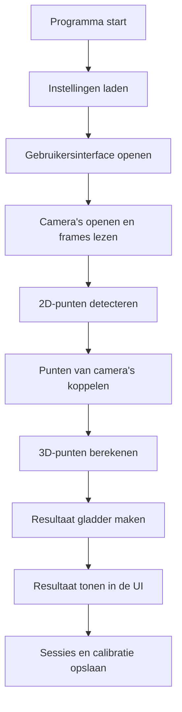

# Programma Structuur: Schoolse Uitleg

Dit document legt de software in eenvoudigere taal uit.
De technische flowchart in [FLOWCHART.md](FLOWCHART.md) blijft bedoeld voor software engineers.
Deze versie is bedoeld voor school, presentaties, verslagen en uitleg aan mensen die de code nog niet goed kennen.

## Wat Doet Deze Software?

De software is een motion capture-applicatie.
Dat betekent dat het programma beelden van een of meer camera's gebruikt om de houding van een persoon te herkennen en daar uiteindelijk een 3D-model van te maken.

Kort gezegd doet de software dit:

1. Camera's openen.
2. Beelden ophalen.
3. In die beelden lichaamspunten zoeken.
4. Punten van meerdere camera's met elkaar vergelijken.
5. Daaruit een 3D-positie berekenen.
6. De resultaten tonen in de gebruikersinterface.
7. Instellingen, calibratie en sessies opslaan.

## Hoofdidee Van De Architectuur

De software is opgesplitst in duidelijke onderdelen.
Dat is belangrijk, omdat een motion capture-app snel groot en onoverzichtelijk kan worden.

De belangrijkste delen zijn:

- `app`: start het programma op en kiest welke modus wordt uitgevoerd.
- `ui`: alles wat de gebruiker ziet en bedient.
- `workers`: achtergrondtaken die zwaar werk doen zonder de interface vast te laten lopen.
- `capture`: haalt beelden op van camera's.
- `detectors`: zoekt 2D-lichaamspunten in een beeld.
- `pipeline`: laat alle verwerkingsstappen achter elkaar lopen.
- `tracking`: maakt de resultaten stabieler over de tijd.
- `reconstruction`: rekent 2D-punten om naar 3D-punten.
- `calibration`: bepaalt hoe camera's precies staan en kijken.
- `session`: slaat informatie van een sessie op.
- `core`: algemene instellingen en logging.
- `models`: gedeelde datatypes die tussen modules worden doorgegeven.

## Simpele Denkwijze

Je kunt de software zien als een fabriek:

- de camera's leveren ruwe beelden aan
- de detector zoekt daarin lichaamspunten
- de pipeline combineert alle stappen
- de reconstructie maakt er 3D van
- de UI laat het resultaat zien
- de opslag bewaart wat later opnieuw nodig is

## Eenvoudige Stroom Van Het Programma

## Wat Gebeurt Er Bij Het Opstarten?

Wanneer de gebruiker het programma start, gebeurt ongeveer dit:

1. `run.py` start het programma.
2. `app/main.py` kijkt welke modus gekozen is.
3. `core/config.py` laadt instellingen zoals camera-bronnen en detector-keuze.
4. `core/logging.py` zorgt dat meldingen in logbestanden terechtkomen.
5. Bij de UI-modus opent `app/ui.py` een Qt-venster.
6. `ui/main_window.py` bouwt de interface op.
7. Een `StartupWorker` laadt op de achtergrond de detector en eventueel een bestaand calibratieprofiel.

Waarom op de achtergrond?
Omdat het laden van detectoren of bestanden even kan duren.
Als dat op de hoofdthread gebeurt, voelt het programma traag of bevriest de interface.

## Wat Is De UI?

De UI is de gebruikersinterface.
Dat is alles wat de gebruiker ziet:

- tabbladen
- knoppen
- live preview
- camerakaarten
- statusinformatie
- sessie-informatie
- calibratiepanelen

Belangrijk principe:
de UI moet vooral tonen en doorgeven wat de gebruiker wil.
De UI hoort niet zelf alle zware beeldverwerking uit te voeren.

Daarom gebruikt de software aparte workers.

## Wat Zijn Workers?

Workers zijn achtergrondtaken.
Ze draaien apart van de hoofdinterface.

In deze software zijn dat bijvoorbeeld:

- `StartupWorker`: laadt detector en calibratie.
- `CameraProbeWorker`: controleert welke camera's beschikbaar zijn.
- `CaptureWorker`: leest continu frames van camera's.
- `CalibrationAnalysisWorker`: analyseert chessboard/calibratiebeelden.
- `PipelineWorker`: voert de motion capture-verwerking uit.

Waarom is dat handig?

- de UI blijft vloeiend
- zware taken blokkeren de knoppen en schermen niet
- capture en verwerking kunnen parallel gebeuren

## Wat Doet De Capture-Laag?

De capture-laag zit vooral in `capture/backend.py`.

Die laag:

- opent camera's of videobronnen
- leest frames
- zet broninformatie om naar een standaardvorm
- geeft een `CaptureBatch` terug

Een `CaptureBatch` is eigenlijk een pakketje met:

- de laatste frames van alle actieve camera's
- timinginformatie
- informatie over bronnen die niet werkten
- probe-resultaten

Dat pakketje gaat daarna verder de pipeline in.

## Wat Doet De Detector?

De detector probeert in elk beeld lichaamspunten te vinden.
Denk aan punten zoals:

- schouder
- elleboog
- heup
- knie

De software heeft op dit moment twee detector-opties:

- `MediaPipePoseDetector`: de echte detector
- `SyntheticPoseDetector`: een demo/fallback detector

De output van een detector is geen 3D-model, maar een 2D-verzameling punten per camera.
Die output heet `Pose2D`.

## Waarom Is 2D Nog Niet Genoeg?

Met 1 camera weet je alleen waar iets in het beeld zit.
Je weet dan nog niet goed hoe ver het punt van de camera af staat.

Daarom zijn meerdere camera's belangrijk.
Als twee of meer camera's hetzelfde lichaamspunt zien, kan de software de echte 3D-locatie schatten.

Dat gebeurt in de reconstructielaag.

## Wat Doet De Pipeline?

De pipeline is het verwerkingspad van de software.
De belangrijkste orchestratie zit in `pipeline/manager.py`.

De volgorde is:

1. Detecteer 2D-punten in elk frame.
2. Koppel punten met dezelfde betekenis aan elkaar.
3. Bereken 3D-punten.
4. Maak het resultaat stabieler.
5. Geef alles terug aan de UI.

De output heet `PipelineResult`.
Daarin zit onder andere:

- de originele frames
- 2D-punten
- eventueel een 3D-pose
- timinginformatie
- waarschuwingen en notities

## Wat Is Matching?

Matching betekent dat de software punten met dezelfde betekenis bij elkaar zet.

Bijvoorbeeld:

- de linkerknie uit camera 1
- de linkerknie uit camera 2
- de linkerknie uit camera 3

Als die punten samen horen, kan de reconstructie proberen daar één 3D-linkerknie van te maken.

In deze software gebeurt dat in `tracking/matcher.py`.

## Wat Is Reconstructie?

Reconstructie is het berekenen van 3D-punten uit meerdere 2D-beelden.
In deze software gebeurt dat in `reconstruction/calibrated_triangulation.py`.

Daar gebruikt de software triangulatie voor.
Dat is een wiskundige methode waarbij stralen vanuit verschillende camera's worden gecombineerd.

Maar dat werkt alleen goed als de software weet:

- waar de camera's staan
- hoe de camera's gericht zijn
- welke lensinstellingen ze hebben

Daarvoor is calibratie nodig.

## Wat Is Calibratie?

Calibratie betekent dat de software leert hoe de camera's zich in de echte ruimte gedragen.

Er zijn twee belangrijke delen:

1. Intrinsics
   Dit gaat over eigenschappen van de camera zelf, zoals lens en beeldvervorming.

2. Extrinsics
   Dit gaat over de positie en oriëntatie van de camera in de ruimte.

In deze software gebruikt calibratie een schaakbordpatroon.
Dat patroon wordt door meerdere camera's bekeken.

Daarna kan `CalibrationManager`:

- corners detecteren
- samplekwaliteit beoordelen
- synchronisatie tussen camera's controleren
- intrinsics oplossen
- extrinsics oplossen
- een `CalibrationBundle` opslaan

Zonder goede calibratie blijft echte 3D-reconstructie bewust beperkt of unavailable.
Dat is juist goed ontwerp, omdat het systeem dan geen nepbetrouwbare 3D-resultaten doet alsof ze correct zijn.

## Wat Doet Tracking/Smoothing?

Ruwe detectie kan schokkerig zijn.
Daarom wordt het 3D-resultaat nog gladgestreken.

In deze software gebeurt dat met `ExponentialPoseSmoother`.

Dat betekent:

- nieuwe waardes worden meegenomen
- oude waardes tellen ook nog een beetje mee
- de beweging ziet er stabieler uit

Dit helpt vooral bij live weergave.

## Waarom Zijn Sessies Belangrijk?

Een sessie is een opgeslagen momentopname van het gebruik van de software.

Daarin kan bijvoorbeeld staan:

- welke camera's actief waren
- welke FPS gebruikt werd
- welke detector gekozen was
- hoeveel frames er waren
- welk calibratiebestand actief was
- extra notities

In deze software gebeurt dat via `SessionRepository`.

Dit is handig voor:

- experimenten herhalen
- later terugkijken
- debugging
- schoolverslagen
- vergelijken van tests

## Wat Wordt Opgeslagen In Configuratie?

De configuratie is iets anders dan een sessie.

Configuratie gaat over standaardinstellingen, zoals:

- standaard camera-input
- standaard FPS
- standaard detector

Deze instellingen worden via `AppConfig` geladen en opgeslagen.

## Wat Zijn De Belangrijkste Datatypes?

De belangrijkste datatypes staan in `models/types.py`.
Dat is handig, omdat alle onderdelen dan dezelfde taal spreken.

Belangrijke voorbeelden:

- `CameraSourceConfig`: beschrijving van een camera of video
- `FramePacket`: één frame
- `Pose2D`: 2D-punten uit één camera
- `Pose3D`: 3D-punten na reconstructie
- `CalibrationBundle`: alle calibratie-informatie
- `PipelineResult`: volledige output van de pipeline
- `SessionManifest`: opgeslagen sessie-informatie

## Waarom Is Deze Structuur Goed?

Deze structuur is goed omdat verantwoordelijkheden gescheiden zijn.

Dat maakt de software:

- duidelijker
- beter testbaar
- makkelijker uit te breiden
- minder foutgevoelig

Als alles in één groot bestand zou zitten, wordt onderhoud veel moeilijker.

## Belangrijkste Les Voor School

De kern van deze software is niet alleen "camera aan en punten tekenen".
De echte kracht zit in de opdeling:

- UI voor interactie
- workers voor achtergrondwerk
- capture voor invoer
- pipeline voor verwerking
- calibration voor nauwkeurigheid
- session/config voor opslag

Dat is precies wat je in moderne software-engineering wilt zien:
heldere verantwoordelijkheden, goede scheiding van taken en een systeem dat later verder kan groeien.

## Korte Samenvatting

De software werkt dus ongeveer zo:

1. Het programma start op en laadt instellingen.
2. De UI wordt geopend.
3. Workers nemen zware taken over.
4. Camera's leveren frames aan.
5. De detector zoekt 2D-lichaamspunten.
6. De pipeline combineert de informatie.
7. De reconstructie probeert daar 3D van te maken.
8. Calibratie bepaalt of die 3D betrouwbaar genoeg is.
9. De UI toont de resultaten.
10. Sessies en instellingen kunnen worden opgeslagen voor later gebruik.

## Handige Combinatie Met De Andere Documenten

- Gebruik [README.md](README.md) voor een algemeen projectoverzicht.
- Gebruik [ARCHITECTURE.md](ARCHITECTURE.md) voor de architectuurprincipes.
- Gebruik [FLOWCHART.md](FLOWCHART.md) voor de technische engineerflow.
- Gebruik [FLOWCHART.png](FLOWCHART.png) voor een visuele export.
- Gebruik dit document wanneer je het systeem in begrijpelijke taal moet uitleggen.
